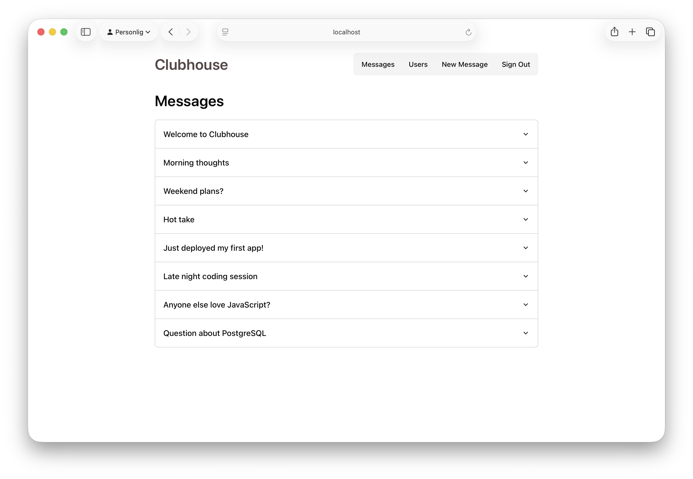
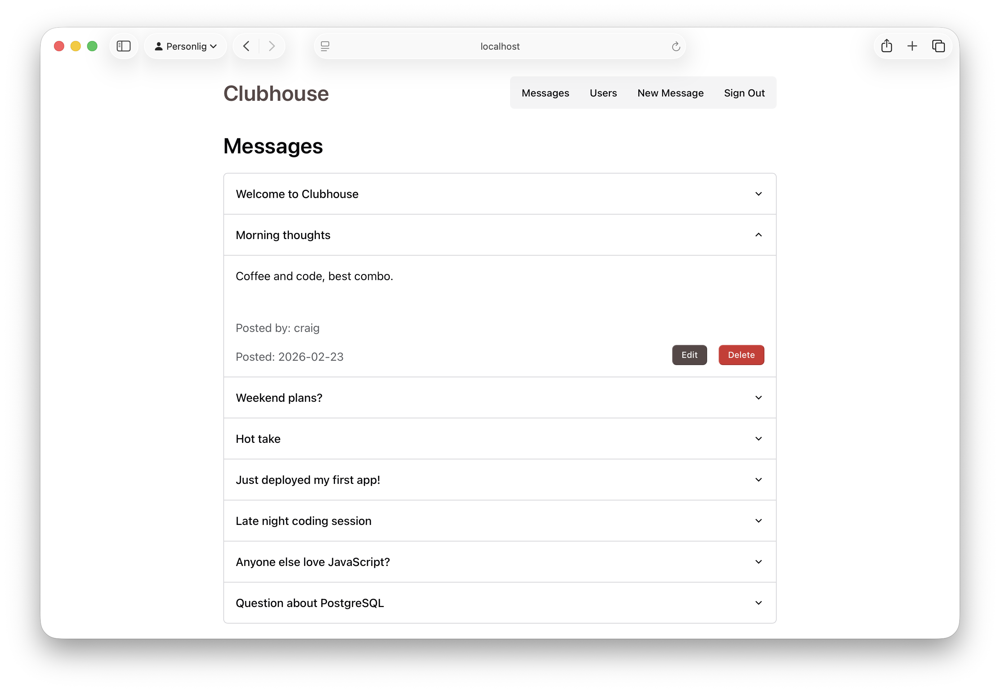
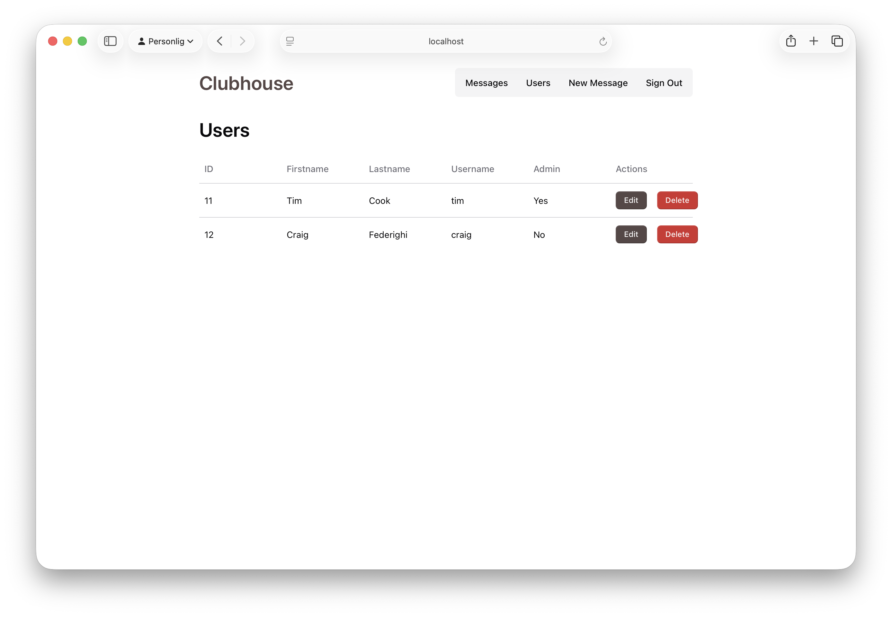
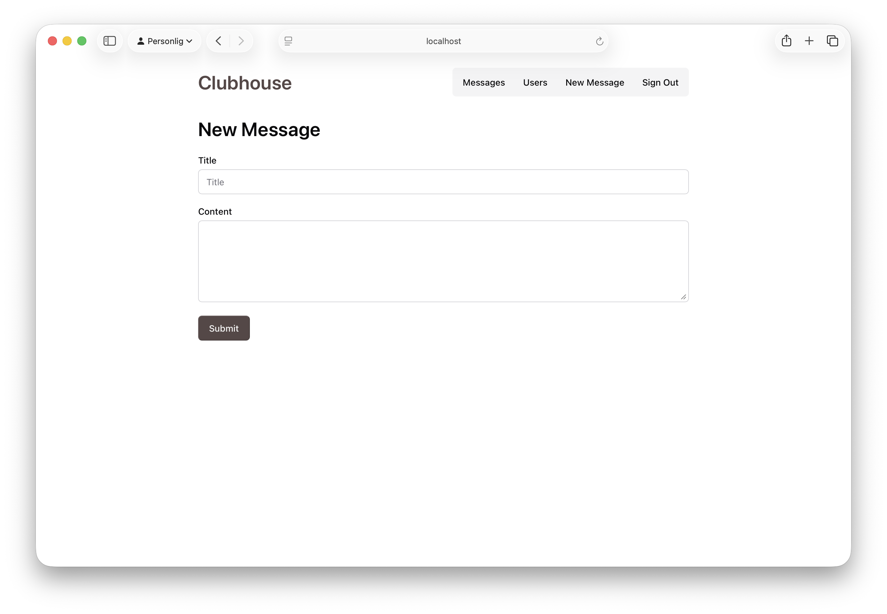
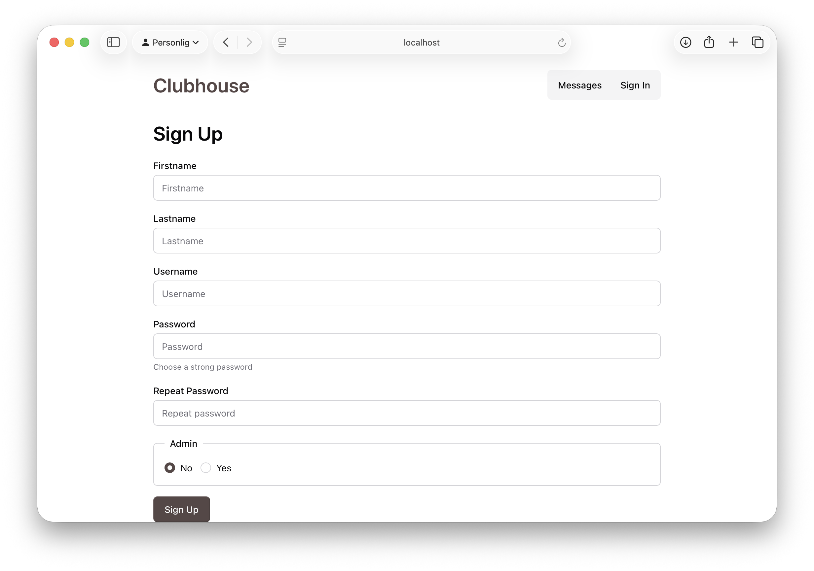

# Clubhouse

A members-only message dashboard built with Node.js, Express, EJS, Passport, and PostgreSQL.

Visitors can read message content, but only signed-in users can see timestamp and who posted each message. Authenticated admins can edit/delete messages and manage users.

## Table of Contents

- [Features](#features)
- [Tools](#tools)
- [Getting Started](#getting-started)
  - [1) Install dependencies](#1-install-dependencies)
  - [2) Create the PostgreSQL database](#2-create-the-postgresql-database)
  - [3) Create tables](#3-create-tables)
  - [4) Create a `.env` file](#4-create-a-env-file)
  - [5) Run the app](#5-run-the-app)
- [Screenshots](#screenshots)

## Features

- Sign up, sign in, and sign out with `passport-local`
- Password hashing with `bcrypt`
- Session-based auth stored in PostgreSQL (`express-session` + `connect-pg-simple`)
- Create and view messages (authenticated users)
- Edit and delete messages (admin)
- Read, update and delete users (admin)
- Server-rendered UI with EJS templates
- Input validation with `express-validator`

## Tools

**Backend**

- Node.js & Express
- EJS – Server-side templating engine

**Database & Persistence**

- PostgreSQL (pg) – database.
- connect-pg-simple – PostgreSQL-based session store

**Authentication & Security**

- Passport.js – Middleware for handling user authentication.
- Express-session – Session management
- Express-validator – Middleware for string validation and sanitization.

**Utilities**

- Oat UI – Component library
- date-fns – parsing and formatting dates.
- dotenv – environment variables

## Getting Started

### 1) Install dependencies

```bash
npm install
```

### 2) Create the PostgreSQL database

```sql
CREATE DATABASE clubhouse;
```

### 3) Create tables

Connect to the `clubhouse` database, then run:

```sql
CREATE TABLE IF NOT EXISTS users (
  id INTEGER GENERATED ALWAYS AS IDENTITY PRIMARY KEY,
  firstname TEXT,
  lastname TEXT,
  username TEXT UNIQUE,
  password TEXT,
  admin BOOLEAN DEFAULT FALSE
);


CREATE TABLE IF NOT EXISTS messages (
  id INTEGER GENERATED ALWAYS AS IDENTITY PRIMARY KEY,
  user_id INTEGER REFERENCES users(id) ON DELETE CASCADE,
  title TEXT,
  content TEXT,
  timestamp TIMESTAMP DEFAULT now()
);


CREATE TABLE session (
  sid varchar NOT NULL,
  sess json NOT NULL,
  expire timestamp(6) NOT NULL
);

ALTER TABLE session
  ADD CONSTRAINT session_pkey PRIMARY KEY (sid);

CREATE INDEX IF NOT EXISTS idx_session_expire
  ON session (expire);

```

### 4) Create a `.env` file

```env
PORT=3000

PG_URI=postgresql://<postgres_user>@localhost:5432/clubhouse

SESSION_SECRET=<your_session_secret>
```

### 5) Run the app

```bash
node app.js
```

Open `http://localhost:3000`.

## Screenshots







